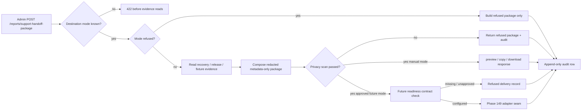

# Phase 148: Support Destination Contract And Credential Readiness - Research

**Researched:** 2026-06-12
**Domain:** Support handoff destination contract, credential readiness, and metadata-only delivery boundaries
**Confidence:** MEDIUM

<user_constraints>
## User Constraints (from CONTEXT.md)

### Locked Decisions
- Keep existing `preview`, `copy`, and `download` modes as the safe manual baseline.
- Keep existing `external_write` refusal as a compatibility/safety mode; do not turn it into a provider adapter.
- Define explicit future provider modes: `internal_queue`, `shared_mailbox`, `zendesk_ticket`, `freshdesk_ticket`, and `helpscout_conversation`.
- Require unknown destination modes to fail before evidence reads, matching the current route/test behavior.
- Readiness should be an admin-visible computed contract, not a secret display surface.
- Store or expose credential references and presence flags only: never token values, authorization headers, API keys, cookies, or provider secrets.
- Readiness states should distinguish configured, missing credential/config, refused/unapproved, and dry-run-safe.
- Provider-specific required fields should remain in allowlisted destination configuration, not in the core package schema.
- Provider payloads should be generated from the already-redacted support package summary, package ID, schema version, evidence reference IDs, safe tags, and approved custom fields.
- Raw report JSON/HTML, S3 object keys, presigned URLs, raw provider/customer payloads, and secrets remain prohibited.
- Attachments are disabled by default for external delivery; if enabled later, they must be redacted package JSON/markdown only with explicit size/type limits.
- Outbound audit should store delivery metadata, provider object references, refusal/failure reasons, privacy result, and payload digest rather than raw outbound payloads.
- Phase 148 should produce a durable contract document and plan the code seams for Phase 149 delivery.
- The preferred first implementation path is a narrow approved destination plus adapter seam, not broad CRM automation.
- Idempotency, retry classification, lifecycle status, and operator queue visibility belong in the contract so Phases 149 and 150 do not invent incompatible state.
- Broad two-way ticket synchronization, SLA analytics, customer messaging campaigns, and additional live providers remain deferred.

### the agent's Discretion
All implementation choices not listed above are at the agent's discretion, provided they preserve metadata-only evidence boundaries and fail closed for unapproved destinations.

### Deferred Ideas (OUT OF SCOPE)
- Actual provider write implementation is deferred to Phase 149.
- Operator queue/detail/retry UI and APIs are deferred to Phase 150.
- Two-way CRM sync, SLA analytics, customer messaging campaigns, and additional provider rollout remain future milestone scope.
</user_constraints>

<phase_requirements>
## Phase Requirements

| ID | Description | Research Support |
|----|-------------|------------------|
| SUPPORTINT-01 | Implementers and operators have a precise destination, credential, payload, and refusal contract before any live support-system write is enabled. | This research locks the current fail-closed baseline, recommends the readiness-state shape, documents metadata-only payload/attachment rules, and identifies the exact planning targets for the Phase 148 contract artifact. [VERIFIED: codebase grep] |
</phase_requirements>

## Summary

Phase 148 should remain a docs/contracts-only phase. The current backend already has the safety baseline that later phases must preserve: manual `preview` / `copy` / `download` modes, explicit `external_write` refusal, admin-only access, redacted free-text handling, metadata-only package composition, and append-only support handoff audit rows. Unknown destinations are rejected before evidence reads, and refused destinations skip evidence reads entirely. [VERIFIED: codebase grep]

The planning target is not “enable a provider.” The planning target is a durable destination contract that specifies: allowed modes, readiness states, credential-reference rules, payload allowlist, attachment policy, refusal semantics, idempotency vocabulary, and future delivery/audit record fields for Phases 149 and 150. Reusing STOA’s existing readiness pattern from billing is the lowest-risk path because it already exposes redacted configured/missing state plus blockers without surfacing secrets. [VERIFIED: codebase grep]

Official provider docs reinforce the same contract-first shape. Freshdesk ticket creation is domain-scoped and rate-limited, Help Scout conversation creation requires mailbox/customer/thread metadata, and SES raw email attachments require MIME/base64 handling. Those constraints make provider-specific configuration an adapter concern, not a core package-schema concern. [CITED: https://developers.freshdesk.com/api/] [CITED: https://developer.helpscout.com/mailbox-api/endpoints/conversations/create/] [CITED: https://docs.aws.amazon.com/ses/latest/dg/send-email-raw.html]

**Primary recommendation:** Plan Phase 148 as one contract artifact plus seam-definition work only: no live writes, no route behavior change that would break the current `external_write` or unknown-destination tests, and no new dependency selection yet. [VERIFIED: codebase grep]

## Architectural Responsibility Map

| Capability | Primary Tier | Secondary Tier | Rationale |
|------------|-------------|----------------|-----------|
| Destination mode allowlist and fail-fast rejection | API / Backend | — | The existing admin route validates destination mode before evidence reads, so the contract and any future expansion belong in backend request validation rather than UI logic. [VERIFIED: codebase grep] |
| Support package composition and redaction | API / Backend | Database / Storage | `support_handoff_service.build_package()` composes the package and privacy validation; evidence data comes from repository helpers but composition stays in the service layer. [VERIFIED: codebase grep] |
| Credential/readiness computation | API / Backend | Database / Storage | STOA already models redacted readiness in backend services, returning configured/missing/blocker state without exposing secret values. [VERIFIED: codebase grep] |
| Delivery/audit lifecycle persistence | Database / Storage | API / Backend | Support handoff audit rows are already stored in DynamoDB-style repository helpers; future delivery records should follow the same persistence boundary. [VERIFIED: codebase grep] |
| Provider-specific field mapping | API / Backend | — | Freshdesk, Help Scout, and SES each require different request fields, so provider mapping must stay in backend adapters rather than the core support package schema. [CITED: https://developers.freshdesk.com/api/] [CITED: https://developer.helpscout.com/mailbox-api/endpoints/conversations/create/] [CITED: https://docs.aws.amazon.com/ses/latest/dg/send-email-raw.html] |
| Operator queue/list/detail visibility | API / Backend | Database / Storage | Phase 150 queue/status views depend on persisted delivery metadata and backend filters, not browser-owned state. [VERIFIED: planning docs] |

## Standard Stack

### Core
| Library | Version | Purpose | Why Standard |
|---------|---------|---------|--------------|
| `fastapi` | `0.136.3` (installed; lock upload 2026-05-23) | Admin route surface and request validation entrypoint. | The current support handoff route already uses FastAPI request models and admin-only routing. [VERIFIED: codebase grep] [VERIFIED: codebase lockfile] |
| `pydantic` | `2.13.4` (installed; lock upload 2026-05-06) | Request model field bounds and structured readiness/contract responses. | `SupportHandoffPackageRequest` already uses Pydantic field constraints, which is the correct place to keep bounded contract inputs. [VERIFIED: codebase grep] [VERIFIED: codebase lockfile] [CITED: https://fastapi.tiangolo.com/tutorial/body/] |
| `boto3` | `1.43.16` (installed; lock upload 2026-05-27) | DynamoDB repository access for audit rows and future delivery records. | Support handoff audit persistence already flows through repository helpers backed by DynamoDB access patterns. [VERIFIED: codebase grep] [VERIFIED: codebase lockfile] |

### Supporting
| Library | Version | Purpose | When to Use |
|---------|---------|---------|-------------|
| `pytest` | `9.0.3` (installed; lock upload 2026-04-07) | Baseline regression coverage for support handoff refusal and privacy invariants. | Use for any Phase 148 seam edits or later destination-readiness tests. Current support handoff tests already cover the hard safety boundaries. [VERIFIED: codebase grep] [VERIFIED: codebase lockfile] |

### Alternatives Considered
| Instead of | Could Use | Tradeoff |
|------------|-----------|----------|
| Adding a provider SDK in Phase 148 | Defer provider SDK choice to Phase 149 | Better because Phase 148 is docs/contracts only and the approved destination is not locked yet. Premature SDK selection would couple the contract to one provider too early. [VERIFIED: planning docs] |
| Free-form destination strings or URLs | Explicit mode enum plus allowlisted config | Required to preserve the current fail-fast behavior and avoid SSRF / secret-routing risk. [VERIFIED: codebase grep] |

**Installation:**
```bash
# None — Phase 148 is docs/contracts only.
```

**Version verification:** Repo-local runtime and lockfile confirm `fastapi==0.136.3`, `pydantic==2.13.4`, `boto3==1.43.16`, and `pytest==9.0.3`. [VERIFIED: codebase lockfile]

## Architecture Patterns

### System Architecture Diagram



### Recommended Project Structure
```text
.planning/phases/148-support-destination-contract-and-credential-readiness/
├── 148-RESEARCH.md                     # This research artifact
├── 148-CONTEXT.md                      # Locked user decisions
└── 148-SUPPORT-DESTINATION-CONTRACT.md # Recommended Phase 148 implementation target

src/stoa/
├── routers/admin.py                    # Existing request model + fail-fast gate; keep behavior stable in Phase 148
├── services/support_handoff_service.py # Existing package composition boundary; do not pollute with provider config
├── services/support_destination_contract.py  # Recommended Phase 149 seam target
└── db/repositories/report_repo.py      # Future delivery/status persistence seam
```

### Pattern 1: Fail-Closed Destination Gate
**What:** Validate destination mode before any evidence reads, and preserve a distinct “refused compatibility mode” for `external_write`. [VERIFIED: codebase grep]
**When to use:** Any future provider mode addition or readiness endpoint. [VERIFIED: planning docs]
**Example:**
```python
# Source: src/stoa/routers/admin.py + src/stoa/services/support_handoff_service.py
destination = body.destination_mode.strip()
if destination not in ALLOWED_DESTINATIONS | REFUSED_DESTINATIONS:
    raise HTTPException(status_code=422, detail=f"Unsupported destination mode: {destination or 'missing'}")

if destination in REFUSED_DESTINATIONS:
    # Skip evidence reads and build a refused package only.
    ...
```

### Pattern 2: Computed Redacted Readiness Matrix
**What:** Return readiness as state + blockers + configured/missing presence flags, not secret values. [VERIFIED: codebase grep]
**When to use:** Future admin-visible destination readiness and delivery-precheck endpoints. [VERIFIED: planning docs]
**Example:**
```python
# Source: src/stoa/services/subscription_service.py
{
    "state": "not_configured" | "live_ready_but_blocked" | "live_enabled" | "test",
    "blockers": [...],
    "warnings": [...],
    "configured": {
        "apiKey": "configured" | "missing",
        "webhookSecret": "configured" | "missing",
    },
}
```

### Pattern 3: Provider-Neutral Core Package, Provider-Specific Adapter Config
**What:** Keep the support handoff package limited to redacted summary data, reference IDs, safe tags, and approved custom fields; move mailbox/domain/token/custom-field mapping into destination config and adapter code. [VERIFIED: planning docs] [CITED: https://developer.helpscout.com/mailbox-api/endpoints/conversations/create/] [CITED: https://developers.freshdesk.com/api/]
**When to use:** Any approved destination in Phase 149 and beyond. [VERIFIED: planning docs]

### Anti-Patterns to Avoid
- **Turning `external_write` into a live adapter in Phase 148:** This breaks the current safety contract and the existing refusal tests. [VERIFIED: codebase grep]
- **Adding provider-specific required fields to `SupportHandoffPackageRequest`:** Current request/body modeling should stay provider-neutral; provider config belongs in allowlisted destination configuration. [VERIFIED: codebase grep] [VERIFIED: planning docs]
- **Logging outbound payload bodies or secrets:** Current audits are metadata-only; future delivery records should keep that property. [VERIFIED: codebase grep]

## Don't Hand-Roll

| Problem | Don't Build | Use Instead | Why |
|---------|-------------|-------------|-----|
| Destination selection | Free-form URLs or arbitrary provider names | Explicit destination mode enum plus allowlisted config | Preserves fail-fast refusal semantics and prevents unsupported routing patterns. [VERIFIED: codebase grep] |
| Secret readiness | Secret-value echo or “truthy config” booleans only | Redacted presence flags plus blockers/warnings/state | STOA already uses this readiness pattern successfully for billing. [VERIFIED: codebase grep] |
| Attachment transport | Raw report HTML/JSON attachment passthrough | Disabled-by-default attachments; later allow only redacted package JSON/markdown with explicit size/type limits | SES attachments require MIME/base64 handling, and raw artifacts violate current privacy boundaries. [CITED: https://docs.aws.amazon.com/ses/latest/dg/send-email-raw.html] [VERIFIED: planning docs] |
| Provider payload history | Full outbound request/response payload archival | Payload digest, provider object refs, refusal/failure reason, and privacy result | Current handoff audit is metadata-only and later delivery audit should stay that way. [VERIFIED: codebase grep] |

**Key insight:** The hard part of this phase is not HTTP transport. The hard part is freezing a contract that later phases cannot accidentally use to leak raw artifacts or secrets. [VERIFIED: planning docs]

## Common Pitfalls

### Pitfall 1: Breaking Current Refusal Semantics While “Just Adding Modes”
**What goes wrong:** A new mode is added directly to the route/service and starts evidence reads or provider work before readiness/refusal rules exist. [VERIFIED: codebase grep]
**Why it happens:** The current route has a simple allowlist/refused split, so it is easy to treat “new mode name exists” as “new mode is enabled.” [VERIFIED: codebase grep]
**How to avoid:** Keep future modes documented in the contract first, and only add a mode to the executable allowlist when its readiness checks and tests exist. [VERIFIED: planning docs]
**Warning signs:** Unknown-destination or `external_write` tests start failing, or evidence reads occur for refused/unapproved modes. [VERIFIED: codebase grep]

### Pitfall 2: Collapsing Validation Success Into Delivery Success
**What goes wrong:** A redacted package is marked “generated” even when destination readiness is missing or a provider call fails. [VERIFIED: planning docs]
**Why it happens:** Current support handoff auditing only distinguishes generated/refused package creation, not delivery lifecycle. [VERIFIED: codebase grep]
**How to avoid:** Phase 148 should define separate vocabulary for package validation status and delivery lifecycle status before Phase 149 writes provider code. [VERIFIED: planning docs]
**Warning signs:** Audit/status fields reuse `generated` for provider errors, or no distinct `failed` / `queued` / `sent` record exists. [VERIFIED: planning docs]

### Pitfall 3: Letting Provider-Specific Fields Pollute The Core Package Schema
**What goes wrong:** Mailbox IDs, domain names, requester objects, or custom-field IDs leak into the main support package request/body. [CITED: https://developer.helpscout.com/mailbox-api/endpoints/conversations/create/] [CITED: https://developers.freshdesk.com/api/]
**Why it happens:** Providers need different fields, so the quickest implementation path is to stuff them into the shared request model. [CITED: https://developer.helpscout.com/mailbox-api/endpoints/conversations/create/] [CITED: https://developers.freshdesk.com/api/]
**How to avoid:** Keep the core package schema provider-neutral and move provider mapping into allowlisted destination config plus adapter-specific command objects. [VERIFIED: planning docs]
**Warning signs:** `SupportHandoffPackageRequest` grows provider-only fields or custom-field blobs. [VERIFIED: codebase grep]

### Pitfall 4: Reintroducing Raw Artifacts Through Attachments
**What goes wrong:** Delivery “works,” but the attached file contains report HTML/JSON, S3 keys, or presigned URLs. [VERIFIED: planning docs]
**Why it happens:** Attachments feel easier than writing a concise provider-neutral summary body. [VERIFIED: planning docs]
**How to avoid:** Default attachments off; if later approved, allow only generated redacted package JSON/markdown with strict type/size limits. [VERIFIED: planning docs] [CITED: https://docs.aws.amazon.com/ses/latest/dg/send-email-raw.html]
**Warning signs:** Attachment policy mentions report artifacts, URLs, or provider upload flows before redacted-package generation exists. [VERIFIED: planning docs]

## Code Examples

Verified patterns from official sources and current code:

### Bounded Request Model For Admin Contract Inputs
```python
# Source: https://fastapi.tiangolo.com/tutorial/body/ and src/stoa/routers/admin.py
from pydantic import BaseModel, Field

class SupportHandoffPackageRequest(BaseModel):
    reason: str = Field(..., min_length=1, max_length=500)
    destination_mode: str = Field(default="preview", min_length=1, max_length=50)
    recovery_job_ids: list[str] = Field(default_factory=list, max_length=5)
    operator_note: str | None = Field(default=None, max_length=1000)
```

### Metadata-Only Audit Write Pattern
```python
# Source: src/stoa/services/support_handoff_service.py
event = {
    "package_id": package["package_id"],
    "result": "refused" if package["destination"]["status"] == "refused" else "generated",
    "metadata": {
        "destination_mode": package["destination"]["mode"],
        "validation_result": package["validation"]["status"],
        "evidence_reference_ids": [...],
        "refusal_reasons": package["destination"]["refusal_reasons"],
        "privacy_passed": package["validation"]["privacy"]["passed"],
    },
}
```

### Provider Constraint Example: Help Scout Conversation Creation
```json
// Source: https://developer.helpscout.com/mailbox-api/endpoints/conversations/create/
{
  "subject": "Subject",
  "customer": { "email": "bear@acme.com" },
  "mailboxId": 85,
  "type": "email",
  "status": "active",
  "threads": [{ "type": "customer", "text": "Hello" }]
}
```

## State of the Art

| Old Approach | Current Approach | When Changed | Impact |
|--------------|------------------|--------------|--------|
| Manual-only handoff with one refused placeholder mode | Contract-first expansion: keep manual baseline, keep `external_write` refused, and define explicit future modes plus readiness model before enabling any provider. | v4.5 planning on 2026-06-12. [VERIFIED: planning docs] | Prevents Phase 149 from inventing payload, credential, and lifecycle semantics ad hoc. |
| One package-level result (`generated` / `refused`) | Separate contract for package validation state and future delivery lifecycle state. | Required by SUPPORTINT-01/02 split in v4.5 requirements. [VERIFIED: planning docs] | Avoids collapsing “safe package exists” into “provider handoff succeeded.” |

**Deprecated/outdated:**
- Treating `external_write` as a generic future delivery hook without an explicit destination contract is outdated for v4.5 and should remain refused until a real approved mode exists. [VERIFIED: codebase grep] [VERIFIED: planning docs]

## Assumptions Log

| # | Claim | Section | Risk if Wrong |
|---|-------|---------|---------------|
| — | None | — | All material claims in this research were verified from the current codebase, planning docs, repo-local runtime, or official provider/framework documentation. |

## Open Questions

1. **Which destination is the first approved live path for Phase 149?**  
   What we know: The context prefers a narrow approved destination plus adapter seam, and the future-mode set includes `internal_queue`, `shared_mailbox`, `zendesk_ticket`, `freshdesk_ticket`, and `helpscout_conversation`. [VERIFIED: planning docs]  
   What's unclear: The first approved live path is not locked yet, so exact credential references and provider-specific required fields cannot be finalized in Phase 148 without an explicit choice. [VERIFIED: planning docs]  
   Recommendation: Plan Phase 148 to define the shared contract and require one explicit destination selection at Phase 149 start.

2. **Should `internal_queue` count as “approved delivery” or only as operator-visible staging?**  
   What we know: Phase 149 must deliver one approved destination path, and Phase 150 owns queue/detail visibility. [VERIFIED: planning docs]  
   What's unclear: Whether `internal_queue` satisfies the business goal alone or only as a prerequisite seam. [VERIFIED: planning docs]  
   Recommendation: Treat `internal_queue` as a safe first adapter if product accepts it as a real handoff destination; otherwise use it only as the persistence seam behind a mailbox/helpdesk adapter.

3. **Who owns provider secrets and approval state?**  
   What we know: The contract must identify credential references, secret ownership, and operator approval gates without exposing secret values. [VERIFIED: planning docs]  
   What's unclear: The specific owning team/person and runtime injection source for each support destination are not in the codebase yet. [VERIFIED: codebase grep]  
   Recommendation: Phase 148 should require an owner field and a redacted reference field per destination in the contract artifact, even if values are initially `TBD`.

## Validation Architecture

### Test Framework
| Property | Value |
|----------|-------|
| Framework | `pytest 9.0.3` [VERIFIED: codebase lockfile] |
| Config file | `pyproject.toml` [VERIFIED: codebase grep] |
| Quick run command | `./.venv/bin/pytest -q tests/test_admin_report_ops.py -k support_handoff` [VERIFIED: codebase grep] |
| Full suite command | `./.venv/bin/pytest -q tests/test_admin_report_ops.py` [VERIFIED: codebase grep] |

### Phase Requirements → Test Map
| Req ID | Behavior | Test Type | Automated Command | File Exists? |
|--------|----------|-----------|-------------------|-------------|
| SUPPORTINT-01 | Unknown destination rejects before evidence reads | unit/api | `./.venv/bin/pytest -q tests/test_admin_report_ops.py -k unknown_destination_rejects_before_evidence_reads` | ✅ |
| SUPPORTINT-01 | `external_write` stays refused without evidence reads | unit/api | `./.venv/bin/pytest -q tests/test_admin_report_ops.py -k external_write_is_refused_without_evidence_reads` | ✅ |
| SUPPORTINT-01 | Credential-like free text is redacted from package and audit | unit/api | `./.venv/bin/pytest -q tests/test_admin_report_ops.py -k redacts_free_text_credentials` | ✅ |
| SUPPORTINT-01 | Metadata-only package composition and audit remain intact | unit/api | `./.venv/bin/pytest -q tests/test_admin_report_ops.py -k composes_metadata_and_audits` | ✅ |

### Sampling Rate
- **Per task commit:** `./.venv/bin/pytest -q tests/test_admin_report_ops.py -k support_handoff`
- **Per wave merge:** `./.venv/bin/pytest -q tests/test_admin_report_ops.py`
- **Phase gate:** Keep all existing support handoff tests green before Phase 149 adds any executable destination behavior.

### Wave 0 Gaps
- [ ] `tests/test_support_destination_contract.py` — future contract/readiness helper coverage for allowed modes, readiness states, and attachment-policy rules.
- [ ] `tests/test_admin_report_ops.py::test_support_handoff_readiness_contract_exposes_redacted_presence_only` — future admin-visible readiness response coverage.

## Security Domain

### Applicable ASVS Categories

| ASVS Category | Applies | Standard Control |
|---------------|---------|-----------------|
| V2 Authentication | yes | Reuse existing authenticated admin route context; no new auth mechanism in Phase 148. [VERIFIED: codebase grep] |
| V3 Session Management | yes | Keep secret-backed/admin-auth path outside the support contract; never expose cookies or tokens in payloads or docs. [VERIFIED: planning docs] |
| V4 Access Control | yes | Support handoff route is admin-only and later readiness/delivery/status routes should stay admin-only. [VERIFIED: codebase grep] |
| V5 Input Validation | yes | Pydantic request bounds plus explicit destination allowlists and attachment-policy enums. [VERIFIED: codebase grep] [CITED: https://fastapi.tiangolo.com/tutorial/body/] |
| V6 Cryptography | yes | Store secret references only; use provider/SDK authentication paths rather than custom crypto or token formats. [VERIFIED: planning docs] |

### Known Threat Patterns for Support-Destination Integration

| Pattern | STRIDE | Standard Mitigation |
|---------|--------|---------------------|
| Free-form destination URL or host selection | Tampering | Enumerated destination modes and allowlisted config only. [VERIFIED: codebase grep] |
| Secret leakage through audit logs or docs | Information Disclosure | Redacted presence flags, secret references only, no raw tokens/headers/cookies. [VERIFIED: planning docs] |
| Raw artifact attachment or URL leakage | Information Disclosure | Metadata-only payload rules; attachments disabled by default; no S3 keys or presigned URLs. [VERIFIED: codebase grep] [VERIFIED: planning docs] |
| Duplicate ticket/email creation on retry | Repudiation | Define idempotency key and retry classification in the contract before provider writes. [VERIFIED: planning docs] |
| Provider success misreported as privacy success | Integrity | Keep package validation status separate from delivery lifecycle status. [VERIFIED: planning docs] |

## Sources

### Primary (HIGH confidence)
- Current codebase inspection: `src/stoa/services/support_handoff_service.py`, `src/stoa/routers/admin.py`, `src/stoa/db/repositories/report_repo.py`, `src/stoa/services/subscription_service.py`, `tests/test_admin_report_ops.py` — current destination gate, package composition, readiness precedent, audit persistence, and regression coverage. [VERIFIED: codebase grep]
- Repo-local runtime: `./.venv/bin/python` and `./.venv/bin/pytest --version` — installed `fastapi`, `pydantic`, `boto3`, and `pytest` versions. [VERIFIED: codebase grep]
- Repo lock/config: `uv.lock`, `pyproject.toml`, `.planning/config.json` — package versions and validation settings. [VERIFIED: codebase lockfile]
- Phase planning docs: `.planning/phases/148-support-destination-contract-and-credential-readiness/148-CONTEXT.md`, `.planning/REQUIREMENTS.md`, `.planning/ROADMAP.md`, `.planning/STATE.md`, `.planning/research/SUMMARY.md`, `.planning/research/ARCHITECTURE.md`, `.planning/research/STACK.md`, `.planning/research/PITFALLS.md`, `.planning/research/FEATURES.md`. [VERIFIED: planning docs]

### Secondary (MEDIUM confidence)
- FastAPI request body / Pydantic model docs: https://fastapi.tiangolo.com/tutorial/body/
- Freshdesk API docs: https://developers.freshdesk.com/api/
- Help Scout create conversation docs: https://developer.helpscout.com/mailbox-api/endpoints/conversations/create/
- Amazon SES raw email docs: https://docs.aws.amazon.com/ses/latest/dg/send-email-raw.html

### Tertiary (LOW confidence)
- None.

## Metadata

**Confidence breakdown:**
- Standard stack: HIGH - Verified against repo-local installed versions and lockfile.
- Architecture: HIGH - Current route/service/repository/test boundaries are explicit in code.
- Pitfalls: MEDIUM - Strongly supported by codebase and official provider docs, but the first approved live destination is still undecided.

**Research date:** 2026-06-12
**Valid until:** 2026-06-26
