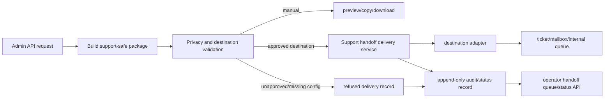

# v4.5 Architecture Research: Support Handoff Delivery

**Updated:** 2026-06-12
**Milestone:** v4.5 Support Evidence Integrations And Operations Handoff

## Existing Architecture

`support_handoff_service.build_package()` already composes a metadata-only package and records audit events through `report_repo.put_support_handoff_audit_event()`. The route tested in `tests/test_admin_report_ops.py` is admin-only and currently supports manual output modes. `external_write` is intentionally refused.

## Proposed Architecture

## Service Boundaries

| Component | Responsibility |
|-----------|----------------|
| `support_handoff_service.py` | Continue package composition, redaction, and manual output modes. |
| New destination contract module | Defines destination modes, required config, payload allowlist, readiness results, and refusal reasons. |
| New delivery service | Converts a validated package into a provider-neutral delivery command and records lifecycle state. |
| Destination adapters | Perform provider-specific request mapping only after contract/readiness passes. |
| `report_repo.py` | Persist handoff delivery records and append-only audit events. |
| Admin routes | Expose readiness, delivery trigger, queue/list/detail, and retry/refusal evidence. |

## Data Model Sketch

Support handoff delivery record:

- `delivery_id`
- `package_id`
- `destination_mode`
- `status`
- `created_at`
- `updated_at`
- `actor`
- `correlation_id`
- `idempotency_key`
- `provider_object_id`
- `provider_object_url`
- `retry_count`
- `failure_reason`
- `refusal_reasons`
- `payload_digest`
- `privacy_result`
- `evidence_reference_ids`

## Adapter Contract

Adapters should accept a redacted provider-neutral payload:

- subject/title
- markdown/plain-text body generated from support package summary
- evidence reference IDs
- package ID and schema version
- tags/labels such as `stoa`, `support-handoff`, milestone/phase when available
- optional provider-specific custom field map from allowlisted configuration

Adapters should return:

- provider status
- provider object ID and URL when available
- retryable/non-retryable error classification
- redacted diagnostic code

## Privacy Architecture

- Validate destination readiness before evidence reads for refused external modes where possible.
- Never pass raw report artifact payloads, S3 keys, presigned URLs, provider secrets, cookies, or tokens into adapter payloads.
- Keep package body generated from already-redacted package sections.
- Store a digest or summary of payload, not the full outbound payload, unless explicitly proven metadata-only and needed for support audit.
- Run the existing private marker scan before delivery and fail closed if privacy validation fails.

## Release Architecture

Phase 148 should decide whether v4.5 first implements `internal_queue`, `shared_mailbox`, or a third-party ticket adapter. The most pragmatic default is `internal_queue` plus a credential-gated external adapter seam unless an approved Zendesk/Freshdesk/Help Scout/SES credential path is already present.
