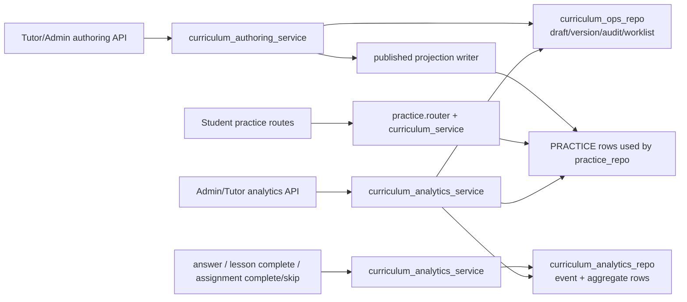

# Architecture Patterns

**Domain:** v4.6 Rich Curriculum Authoring And Analytics Foundation
**Researched:** 2026-06-12

## Recommended Architecture

Extend the existing backend in three layers, not with a new subsystem:

1. Keep published student-facing curriculum as a `practice` read model backed by `practice_repo` and the existing `PRACTICE` partition.
2. Add a separate admin curriculum operations layer for draft, review, publish, archive, rollback, and audit metadata in the same DynamoDB table.
3. Add a bounded analytics materialization layer that consumes existing practice and adaptive-learning write paths and exposes aggregate admin/tutor signals without exposing student-level detail.

This fits the current codebase shape:

- `src/stoa/routers/practice.py` already owns student/tutor curriculum reads.
- `src/stoa/services/curriculum_service.py` already mediates published catalog/preview behavior.
- `src/stoa/routers/admin.py` shows the preferred internal-ops pattern: role-guarded endpoints -> service layer -> repository writes -> append-only audit.
- `src/stoa/services/adaptive_learning_service.py` already centralizes assignment outcomes and learning-memory signal generation.

Recommended high-level flow:

## New Components

| Component | Type | Responsibility | Why new |
|-----------|------|----------------|---------|
| `src/stoa/routers/admin_curriculum.py` | Router | Admin/tutor authoring, review, publish, archive, rollback, analytics endpoints under `/admin/curriculum/*`. | `admin.py` is already large; this keeps curriculum operations isolated. |
| `src/stoa/services/curriculum_authoring_service.py` | Service | Validation, lifecycle transitions, preview diffing, publish/apply, rollback/archive safety, audit writes. | Existing `curriculum_service.py` is read-oriented; mutation logic should not live there. |
| `src/stoa/services/curriculum_analytics_service.py` | Service | Signal recording, aggregate rollups, admin analytics responses, staleness/gap scoring. | Analytics should be centralized rather than embedded in routes or adaptive service. |
| `src/stoa/db/repositories/curriculum_ops_repo.py` | Repository | Draft/version/summary/worklist/audit persistence for lessons and exercises. | Keeps authoring state separate from `practice_repo` read concerns. |
| `src/stoa/db/repositories/curriculum_analytics_repo.py` | Repository | Analytics event append and aggregate read/write helpers. | Avoids mixing operational counters into `practice_repo` or `adaptive_learning_repo`. |
| `src/stoa/models/curriculum_ops.py` | Model/schema | Pydantic contracts for draft payloads, review outcomes, publish/archive/rollback requests, analytics responses. | Needed to keep route contracts explicit and testable. |

## Modified Components

| File | Change |
|------|--------|
| `src/stoa/main.py` | Register the new admin curriculum router with `/admin`. |
| `src/stoa/services/curriculum_service.py` | Keep existing `/practice/curriculum/*` contracts stable, but overlay preview data from `curriculum_ops_repo` for tutor/admin preview reads. |
| `src/stoa/db/repositories/practice_repo.py` | Add narrow published-projection write helpers for lesson/challenge upsert/archive during publish/rollback. Keep existing read APIs intact. |
| `src/stoa/routers/practice.py` | After answer and lesson-complete mutations, emit analytics signals via the new service. Route shapes should stay stable. |
| `src/stoa/services/adaptive_learning_service.py` | Emit assignment-completed, assignment-skipped, and memory-refresh signals into analytics materialization. |
| `tests/test_curriculum_rollout.py` | Extend current curriculum visibility tests to cover preview overlay and published-only guarantees. |
| New tests | Add focused authoring and analytics coverage, similar in style to `tests/test_admin_report_ops.py`. |

## Component Boundaries

| Component | Responsibility | Communicates With |
|-----------|---------------|-------------------|
| `practice.router` | Published curriculum reads and student practice mutations. | `curriculum_service`, `practice_repo`, `curriculum_analytics_service` |
| `curriculum_service` | Read-model assembly for catalog, lesson detail, exercises, and progress. | `practice_repo`, `curriculum_ops_repo` |
| `admin_curriculum.router` | Internal authoring/review/publish/archive/rollback/analytics APIs. | `curriculum_authoring_service`, `curriculum_analytics_service`, `require_role` |
| `curriculum_authoring_service` | Lifecycle rules, validation, separation of draft vs published, projection updates, audit. | `curriculum_ops_repo`, `practice_repo` |
| `curriculum_analytics_service` | Signal ingestion and aggregate query responses. | `curriculum_analytics_repo`, `practice_repo`, `curriculum_ops_repo` |
| `curriculum_ops_repo` | Single-table authoring state. | DynamoDB |
| `curriculum_analytics_repo` | Single-table signal and aggregate state. | DynamoDB |

## API Boundaries

Keep published reads where they are:

- `/practice/curriculum/catalog`
- `/practice/curriculum/lessons/{lesson_id}`
- `/practice/curriculum/exercises`
- `/practice/curriculum/progress`

Add internal APIs under `/admin/curriculum`:

- `GET /admin/curriculum/worklist`
- `GET /admin/curriculum/lessons/{lesson_id}`
- `POST /admin/curriculum/lessons`
- `POST /admin/curriculum/lessons/{lesson_id}/drafts`
- `POST /admin/curriculum/lessons/{lesson_id}/submit-review`
- `POST /admin/curriculum/lessons/{lesson_id}/publish`
- `POST /admin/curriculum/lessons/{lesson_id}/archive`
- `POST /admin/curriculum/lessons/{lesson_id}/rollback`
- Equivalent exercise endpoints nested under the lesson or parallel under `/exercises`
- `GET /admin/curriculum/analytics/overview`
- `GET /admin/curriculum/analytics/topics`
- `GET /admin/curriculum/analytics/lessons/{lesson_id}`
- `GET /admin/curriculum/analytics/exercises/{exercise_id}`

Use explicit action endpoints, not a generic status patch API. That matches the current admin internal-ops style and makes audit reasons mandatory per transition.

## Repository Pattern

### Published Read Model

Continue using the existing `PRACTICE` partition as the source of truth for published student-facing content only:

- `PK=PRACTICE`, `SK=SUBJECT#...`
- `PK=PRACTICE`, `SK=TOPIC#...`
- `PK=PRACTICE`, `SK=UNIT#...`
- `PK=PRACTICE`, `SK=LESSON#...`
- `PK=PRACTICE`, `SK=CHALLENGE#{lesson_id}#...`

Do not store draft-only content in this partition. That is how student/parent visibility stays stable.

### Authoring State

Use separate per-entity partitions in the same table:

- `PK=CURRICULUM#LESSON#{lesson_id}`, `SK=SUMMARY`
- `PK=CURRICULUM#LESSON#{lesson_id}`, `SK=VERSION#{version_id}`
- `PK=CURRICULUM#LESSON#{lesson_id}`, `SK=AUDIT#{timestamp}#{event_id}`
- `PK=CURRICULUM#EXERCISE#{exercise_id}`, same pattern

Optional worklist feed rows to avoid table-wide scans:

- `PK=CURRICULUM_WORKLIST`, `SK={state}#{updated_at}#{content_type}#{content_id}`

Summary rows should carry:

- `content_type`
- `content_id`
- `subject_id`
- `topic_id`
- `lesson_id` for exercises
- `lifecycle_state` such as `draft`, `in_review`, `published`, `archived`
- `current_version_id`
- `published_version_id`
- `last_reviewed_at`
- `last_reviewed_by`
- `published_at`
- `published_by`
- `archived_at`
- `archived_by`
- `rollback_version_id` or prior published pointer
- `updated_at`

Version rows should be immutable snapshots of the authorable payload plus validation results.

### Apply / Publish Pattern

Mirror the report-operations compare-and-set pattern from `report_repo`:

- draft creation is append-only
- publish uses conditional update against expected `updated_at` and expected `current_version_id`
- rollback uses conditional update against expected published version pointer
- audit rows are append-only

That avoids a second admin overwriting a reviewed version after stale UI state.

## Data Flow

### Authoring And Publication

1. Tutor/admin submits a draft to `/admin/curriculum/...`.
2. `curriculum_authoring_service` validates completeness:
   - required text
   - supported language coverage
   - answer key/hint/explanation presence for exercises
   - difficulty/subject/topic metadata
3. Service writes an immutable `VERSION#...` row and updates `SUMMARY` to `draft` or `in_review`.
4. Reviewer/admin publishes with reason.
5. Service conditionally updates the summary to a new `published_version_id`.
6. Service materializes the published projection into `PRACTICE` rows through `practice_repo` write helpers.
7. Service appends an audit row and updates the worklist feed.

### Preview Reads

1. Student/parent requests stay unchanged and read only the `PRACTICE` projection.
2. Tutor/admin preview requests still use `/practice/curriculum/*?includePreview=true`.
3. `curriculum_service` overlays the latest draft/review version from `curriculum_ops_repo` when preview is allowed.

This keeps the external practice contract stable while still making preview usable.

### Analytics

Signals should come from existing mutation points, not from periodic full-table scans:

- `POST /practice/challenges/{challenge_id}/answer`
- `POST /practice/lessons/{lesson_id}/complete`
- `adaptive_learning_service.transition_assignment()` on `complete` and `skip`
- publish/archive/rollback transitions in `curriculum_authoring_service`

Each signal should:

1. append one immutable analytics event row
2. update one or more aggregate summary rows synchronously

Recommended aggregate scopes:

- exercise
- lesson
- topic
- subject

Recommended windows:

- `WINDOW#ALL_TIME`
- `WINDOW#WEEK#{iso_monday}`

This is enough for operational analytics without introducing a warehouse.

## Analytics Aggregation Strategy

Prefer materialized aggregates over request-time joins across all students. Current repos already rely on scans for some workflows; analytics should not add more request-time scans.

Recommended item shapes:

- `PK=CURRICULUM_SIGNAL#EXERCISE#{exercise_id}`, `SK=EVENT#{timestamp}#{event_id}`
- `PK=CURRICULUM_ANALYTICS#EXERCISE#{exercise_id}`, `SK=WINDOW#ALL_TIME`
- `PK=CURRICULUM_ANALYTICS#EXERCISE#{exercise_id}`, `SK=WINDOW#WEEK#{iso_monday}`
- same shape for `LESSON`, `TOPIC`, `SUBJECT`

Track bounded metrics only:

- `attempt_count`
- `incorrect_attempt_count`
- `lesson_completion_count`
- `assignment_completed_count`
- `assignment_skipped_count`
- `last_activity_at`
- `last_published_at`
- `last_reviewed_at`
- `published_version_id`

Derive admin signals from those counters:

- `confusing_exercise`: high incorrect rate after minimum sample threshold
- `weak_topic`: repeated incorrect and skipped signals aggregated at topic level
- `stale_lesson`: old `published_at` or `last_reviewed_at` plus ongoing activity
- `content_gap`: high weak-topic signal with low published lesson/exercise coverage

Privacy boundary:

- no student IDs
- no freeform student answers
- no raw question text outside existing published content
- suppress or mark `insufficient_sample` for very low-volume per-exercise metrics

## Patterns To Follow

### Pattern 1: Published Projection + Draft Overlay

**What:** Keep published rows in `PRACTICE`; store draft/review state separately and overlay only for authorized preview.

**When:** Any curriculum mutation that must not leak into student-visible APIs before publish.

**Why:** It preserves the current `/practice/curriculum/*` contract and avoids mixing student reads with admin drafts.

### Pattern 2: Immutable Versions + Conditional Publish

**What:** Every draft submission creates an immutable version row; publish/rollback only moves pointers.

**When:** Lessons and exercises that need rollback safety and review audit.

**Why:** This is the lightest way to get rollback/archive safety in the current single-table architecture.

### Pattern 3: Signal-On-Write Analytics

**What:** Record analytics at existing write points and materialize aggregates immediately.

**When:** Answer submission, lesson completion, assignment transitions, publish/archive.

**Why:** It avoids building a separate pipeline or warehouse and stays within current infrastructure constraints.

## Anti-Patterns To Avoid

### Anti-Pattern 1: Drafts In The `PRACTICE` Read Model

**What:** Writing draft lesson/exercise content directly into the same rows student reads.

**Why bad:** `practice_repo` and `curriculum_service` currently assume those rows are the catalog. Draft leakage would break the requirement to keep student-visible content stable during review.

**Instead:** Keep draft/review versions in `curriculum_ops_repo`; publish writes the projection.

### Anti-Pattern 2: Admin Analytics From Full Runtime Scans

**What:** Building overview analytics by scanning all progress, mistakes, assignments, and questions at request time.

**Why bad:** Current table-scan patterns are acceptable for small operational endpoints, but this will become slow and expensive quickly.

**Instead:** Materialize aggregates during writes and read only summary rows for dashboards.

### Anti-Pattern 3: Cramming v4.6 Into `admin.py`

**What:** Adding another large block of curriculum lifecycle and analytics endpoints into the existing `admin.py`.

**Why bad:** The file is already large and mixes multiple domains. It will become hard to test and reason about.

**Instead:** Create a dedicated admin curriculum router and service pair.

## Role And Privacy Boundaries

| Role | Allowed |
|------|---------|
| `student` | Published curriculum reads and own progress only. |
| `parent` | No authoring or analytics detail; only existing parent-visible progress/report surfaces. |
| `tutor` / `teacher` | Draft create/edit, preview, submit for review, aggregate analytics reads. |
| `admin` | Full publish/archive/rollback authority, analytics access, override operations, audit inspection. |

Recommended separation of duties:

- tutors/teachers can author
- admins publish/archive/rollback
- if tutors can review, keep publish authority with admin for MVP

## Build Order

1. **Authoring Data Model First**
   - Add `curriculum_ops_repo`, models, and admin curriculum router skeleton.
   - Implement lesson/exercise draft create/read/worklist and append-only audit.
   - No published projection writes yet.

2. **Publish / Archive / Rollback Safety**
   - Add immutable versions and conditional publish/rollback.
   - Add `practice_repo` projection write helpers.
   - Update `curriculum_service` preview overlay while keeping published reads stable.
   - Extend `tests/test_curriculum_rollout.py` to prove draft isolation and publish visibility.

3. **Analytics Instrumentation**
   - Add `curriculum_analytics_repo` and `curriculum_analytics_service`.
   - Instrument `practice.py` answer/complete writes and `adaptive_learning_service.transition_assignment()`.
   - Materialize exercise/lesson/topic aggregates and expose admin analytics endpoints.

4. **Release Gate And Backfill Safety**
   - Add analytics backfill/recompute command or admin-only maintenance path for local verification.
   - Verify archive/rollback behavior, aggregate correctness, role boundaries, and docs.

Build in this order because analytics needs stable content IDs and lifecycle metadata; lifecycle safety must exist before published authoring goes live.

## Scalability Considerations

| Concern | At 100 users | At 10K users | At 1M users |
|---------|--------------|--------------|-------------|
| Published curriculum reads | Current `practice_repo` queries are acceptable. | Still acceptable if catalog size stays modest. | Likely needs more selective projections or indexed access. |
| Authoring worklist | Single worklist partition is fine. | May need sharded worklist prefixes by state/subject. | Probably needs a GSI if operator queries become large. |
| Analytics reads | Materialized summaries are cheap. | Still fine with weekly windows. | Event growth may require archival or a warehouse later, but not in v4.6. |
| Analytics writes | Synchronous counter updates are fine. | Fine if writes stay bounded to a few aggregate rows per event. | May need async fanout later, but current milestone should stay synchronous. |

## Sources

- `.planning/PROJECT.md`
- `.planning/REQUIREMENTS.md`
- `.planning/ROADMAP.md`
- `src/stoa/main.py`
- `src/stoa/routers/admin.py`
- `src/stoa/routers/practice.py`
- `src/stoa/services/curriculum_service.py`
- `src/stoa/services/adaptive_learning_service.py`
- `src/stoa/db/repositories/practice_repo.py`
- `src/stoa/db/repositories/adaptive_learning_repo.py`
- `src/stoa/db/repositories/report_repo.py`
- `tests/test_admin_report_ops.py`
- `tests/test_curriculum_rollout.py`

Note: the requested `tests/test_practice.py` path is not present in the repo; `tests/test_curriculum_rollout.py` is the current curriculum/practice test coverage used for this research.
